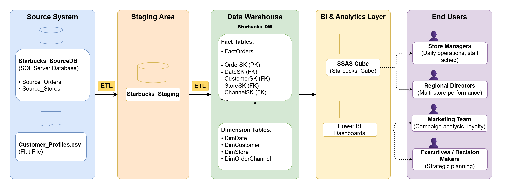
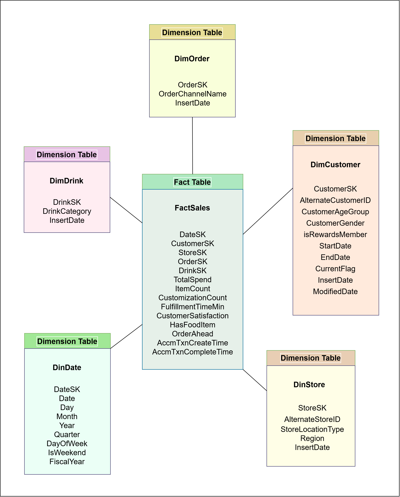

# ☕ Starbucks Data Warehouse & Business Intelligence Solution

## 📊 Overview
Designed and implemented an end-to-end Business Intelligence solution for analyzing Starbucks customer ordering behavior using SQL Server, SSIS, SSAS, and Power BI.

## 🎯 Objectives
- Analyze customer ordering patterns
- Track sales performance
- Enable multidimensional analysis
- Support business decision-making through dashboards

## 🏗️ Solution Architecture

Data Source → Staging Area → Data Warehouse → SSAS Cube → Power BI Dashboard

## 🧱 Data Warehouse Design

### Fact Table
- FactSales

### Dimension Tables
- DimCustomer
- DimDate
- DimDrink
- DimStore
- DimOrder

### Schema
Star Schema

## 🔄 ETL Process (SSIS)
- Extract data from source files
- Clean and transform data
- Load data into dimension tables
- Load data into fact tables
- Implement SCD Type 2 for customer history tracking

## 📈 OLAP & Analytics (SSAS)
- Multidimensional Cube Development
- Drill Down
- Roll Up
- Slice and Dice
- Pivot Analysis

## 📊 Power BI Dashboards
- KPI Dashboard
- Matrix Analysis
- Sales Trend Analysis
- Customer Ordering Analysis

## 🚀 Business Insights
- Peak ordering periods
- Most popular drink categories
- Customer purchasing patterns
- Store performance comparison

## 🛠️ Technologies
- SQL Server
- SSIS
- SSAS
- Power BI

## 📱 Screenshots
<table>
<tr>
<td align="center">

 <b>Drill Down Analysis</b>
</td>

<td align="center">

 <b>Slice Operation Analysis</b>
</td>
</tr>

<tr>
<td align="center">

 <b>Solution Architecture</b>
</td>

<td align="center">

 <b>Star Schema Design</b>
</td>
</tr>
</table>

## 👩‍💻 Author
Nimanthi Weerakoon
